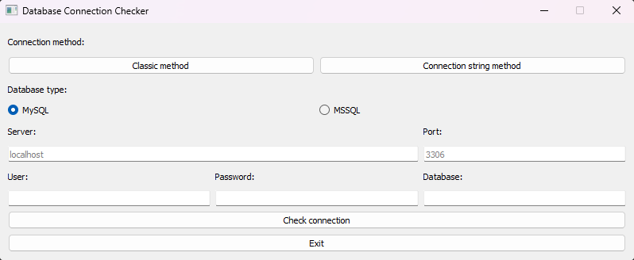

# Database_Connection_Checker

This app will check if given credentials are valid and allow to connect to database.

MySQL and MSSQL supported.

There are two ways of providing credentials:
1. Form-like interface, where you can type data in labeled input fields.
2. Connection string - you have to provide connection string for your server.
